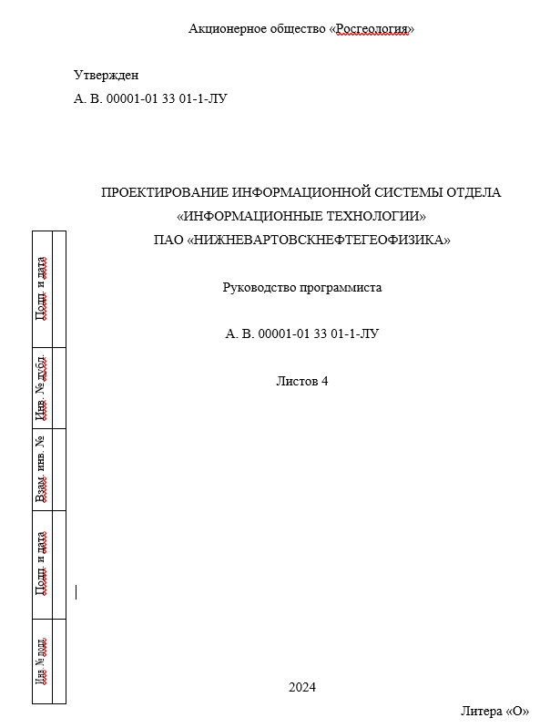

# Руководство программиста

{width="8.246364829396326in"
height="11.647971347331584in"}

## 1\. Назначение и условия применения программы

Назначение программы

Программа предназначена для автоматизации технического обслуживания
средств вычислительной техники (ТО СВТ) в организации. В функции
включают:

-   Управление заявками сотрудников;

-   Учёт и инвентаризация оборудования;

-   Создание и учёт актов нарядов;

-   Хранение и управление документами, связанными с ТО.

Условия применения программы.

Для работы программы необходимы:

1\. Аппаратные ресурсы:

-   Минимум 8 ГБ оперативной памяти;

-   Жёсткий диск не менее 500 ГБ;

-   Процессор с тактовой частотой не менее 2.4 ГГц (4 ядра).

2\. Программные ресурсы:

-   Операционная система: Windows Server или Linux;

-   Сервер баз данных (например, PostgreSQL, MySQL).

3\. Периферийные устройства:

-   Мышь, клавиатура, монитор.

## 2\. Характеристики программы

Основные характеристики:

-   Режим работы: программа работает в режиме клиент-серверного
    приложения.

-   Многопользовательская работа с разграничением прав доступа (роли:
    Администратор, Начальник ОИТ, ИТ-инженер, Сотрудник);

-   Средства контроля правильности выполнения операций с возможностью
    логирования всех действий пользователей.

-   Самовосстанавливаемость: реализованы автоматическое восстановление
    после сбоев и регулярное создание резервных копий базы данных.

-   Временные характеристики: среднее время обработки заявки --- менее 1
    секунды (при стандартной нагрузке).

## 3\. Обращение к программе

1\. Процедура вызова.

Для запуска программы:

-   Запустите платформу 1С:Предприятия;

-   Откройте клиентское приложение и введите адрес сервера.

2\. Передача параметров.

-   Передача данных между клиентами и сервером осуществляется по
    кластеру сервера. Для авторизации используются ссылки подключения к
    серверу.

## 4\. Входные и выходные данные

1\. Входные данные.

Заявки сотрудников:

Ввод через форму заявки, включает описание проблемы.

Данные инвентаризации:

Информация об оборудовании, включая серийный номер, расположение и
состояние.

Документы:

Проведение закупочной деятельности, утилизация и списание оргтехники.

2\. Выходные данные.

Объекты:

-   Документы;

-   Справочники.

## 5\. Сообщения

Программа выдаёт следующие сообщения:

-   Ошибка «Поле объекта не обнаружено». Возникает, если удалить
    табличную часть, к которой обращаются в коде, переименовать реквизит
    и не исправить это в коде или заменить значение со ссылки на
    неопределённое.

-   Ошибка формата потока. Возникает из-за неправильного или аварийного
    завершения работы программы 1С, например, при отключении
    электричества или выключении компьютера при открытой программе. Для
    решения проблемы нужно удалить все лишние файлы из папки с базой
    (файл 1Cv8.1CD удалять нельзя). Также можно удалить информационную
    базу из списка в окне запуска 1С и добавить обратно.

-   Ошибка «Несоответствие типа данных поля» в 1С возникает, когда в
    командах системы параметры указаны не в той очерёдности или название
    не соответствует типу данных.

-   Ошибка использования одинаковых имён переменных и имён реквизитов
    формы.
