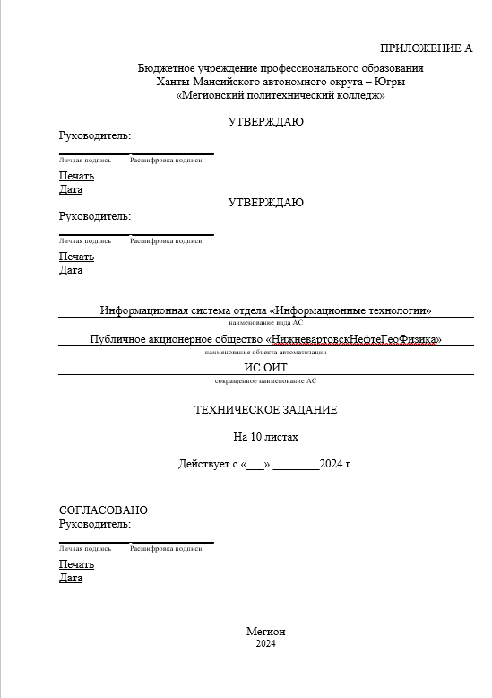

# Техническое задание

## 1. Общие сведения

Настоящее техническое задание распространяется на разработку
информационной системы (ИС) отдела «Информационные технологии»,
необходимой для ПАО «НижневартовскНефтеГеоФизика». Данная ИС
предназначена для автоматизации и оптимизации процессов, связанных с
поддержанием работоспособности оборудования и технического обслуживания
в организации.

Наименование работы: ИС отдела «Информационные технологии»

Разработчик: Бражник Роман Игоревич.

Заказчик: ПАО «НижневартовскНефтеГеоФизика».

Плановые сроки начала и окончания работ по проектированию
автоматизированной системы: с 2 сентября 2024 -- до 10 ноября 2024.

Курсовой проект по проектированию автоматизированной системы проводится
на основе учебного плана и утвержден БУ «Мегионский политехнический
колледж».

Источник финансирования не требуется, поскольку проектирование
автоматизированной системы осуществляется в рамках учебного процесса.
Данный проект направлен на получение знаний и практических навыков, что
позволяет углубить компетенции без необходимости привлечения внешних
финансовых ресурсов.

## 2. Назначение и цели создания автоматизированной системы

Цель проектирования информационной системы для ОИТ --- эффективное и
оперативное осуществление технического обслуживания средств
вычислительной техники с минимизацией простоев и удовлетворением
запросов сотрудников.

Спроектируемая информационная система отдела «Информационные технологии»
предназначена для автоматизации процесса обслуживания и управления
ресурсами ОИТ.

## 3. Характеристика объектов автоматизации

Объектом автоматизации является отдел «Информационные технологии».
Объект автоматизации обусловлен необходимостью автоматизации и
оптимизации поддерживать техническое обслуживание средств вычислительной
техники (ТО СВТ), обеспечивать эффективное функционирование рабочих
процессов и оптимизировать затраты на обслуживание и ремонт техники.

Информационная система обеспечит следующие функции:

-   авторизация пользователей;

-   учет и обработка обращений сотрудников;

-   ведение базы данных инвентаря и учет состояния техники;

-   создание и обработка заявок на обслуживание;

-   учет и контроль за закупками оборудования и расходных материалов.

Система будет установлена на выделенном сервере, подключенном к
корпоративной сети. В условия эксплуатации объекта автоматизации
включают:

1\. Оптический канал с пропускной способностью не менее 2 Гбит/с;

2\. Системы защиты от несанкционированного доступа;

3\. Электропитание оборудования первой категории надежности;

4\. Промышленную систему вентиляции и кондиционирования;

5\. Систему автоматического газового пожаротушения.

## 4. Требования к автоматизированной системе

Требования к структуре автоматизированной системы включают:

• Авторизация пользователей;

• Подсистема «Акт Наряды» - содержит информацию о нарядах заявок;

• Подсистема «Заявки» - содержит заявки от сотрудников;

• Подсистема «Документы» - содержит документы закупочной деятельности,
списанной и утилизированной оргтехники;

• Подсистема «Инвентаризация» - содержит актуальные данные об инвентаре;

• Подсистема «Справочники» - содержит категории справочников: данные об
предприятии и данные о средствах вычислительной техники.

Требования к функциям автоматизированной системы включают:

-   Авторизация пользователей;

-   Подсистема «Акт Наряды» - обслуживания нарядов на заявки;

-   Подсистема «Заявки» - обработка заявок на обслуживание от
    сотрудников;

-   Подсистема «Документы» - проведение закупочной деятельности,
    списание и утилизация оргтехники;

-   Подсистема «Инвентаризация» - ведение и актуализация данных об
    оборудовании и инвентаре;

-   Подсистема «Справочники» - хранение данных сотрудников, различных
    типов данных средств вычислительной техники и данных заявок.

Требования к видам обеспечения автоматизированной системы включают:

-   Для математического вида обеспечения АС не требуется применение
    математических методов и алгоритмов;

-   Для информационного вида обеспечения АС используется организация
    данных объектами справочник и документ, состав и структура зависит
    от наполняемых данных;

-   Для лингвистического вида обеспечения АС возможности расширения
    наборов языка не требуется, как и тезаурусов и словарей. К способам
    организации диалога используются поля формы;

-   Для программного вида обеспечения АС требования к составу и
    программному обеспечению изложены в предыдущем пункте оглавления
    технического задания;

-   Для технического вида обеспечения АС требуется надёжная
    инфраструктура, включая серверное оборудование и сети, которые
    обеспечат бесперебойную работу системы и доступ к ней для всех
    сотрудников;

-   Для метрологического вида обеспечения АС используется соответствие
    требованиям, прописанное к автоматизированной системе;

-   Для организационного вида обеспечения АС определяется
    взаимодействием сотрудников с отделом «Информационные технологии»;

-   Для методического вида обеспечения АС используется ГОСТ 34.602-2020
    «Информационные технологии. Комплекс стандартов на
    автоматизированные системы. Техническое задание на создание
    автоматизированной системы».

Общие технические требования к АС включают следующее:

-   Численность и квалификация персонала и пользователей не требуется;

-   Автоматизированная система должна обеспечивать выполнение
    поставленных задач;

-   Система должна обеспечивать высокий уровень надёжности, сводя к
    минимуму вероятность сбоев и ошибок в работе;

-   Необходимо предусмотреть меры по защите системы от внешних и
    внутренних угроз, включая физическую безопасность оборудования и
    защиту программного обеспечения;

-   Интерфейс АС должен быть удобным и интуитивно понятным для
    пользователей, а также соответствовать современным эстетическим
    стандартам;

-   Требования к транспортабельности для подвижных АС не требуется;

-   Обслуживание АС должно вестись на стороне администрирования сервера
    и со стороны клиентской программы;

-   Защита от несанкционированного доступа должна регулироваться
    авторизацией пользователя, эксплуатация наличием установленной
    программы;

-   Данные должны храниться на серверах, чтобы не допустить потерю
    информации;

-   Система должна быть защищена от воздействия внешних факторов, таких
    как температура, влажность, электромагнитные помехи и другие;

-   Все компоненты и технологии, используемые в АС, должны
    соответствовать требованиям патентного законодательства и не
    нарушать права третьих лиц;

-   Требования по стандартизации должны быть соблюдены по разработанному
    техническому заданию.

## 5. Состав и содержание работ по созданию автоматизированной системы

Перечень этапов работ:

1\. Исследование и изучение информации для теоретической части;

2\. Составление аналитической справки;

3\. Составление ТЗ;

4\. Построение диаграмм вариантов использования;

5\. Построение диаграммы классов;

6\. Описание проектируемой информационной системы;

7\. Прототипирование ИС.

## 6. Порядок разработки автоматизированной системы

Разработка ведется поэтапно с предварительным тестированием каждой
компоненты.

После завершения каждого этапа проводятся интеграционные тесты, чтобы
убедиться, что все компоненты работают корректно в составе системы.

На финальной стадии проводится тестирование системы в условиях рабочего
процесса, чтобы выявить и устранить возможные ошибки.

После тестирования система передается заказчику для проведения
приемочных испытаний.

## 7. Порядок контроля и приемки автоматизированной системы

Информационная система проходит тестирование методом «Черного ящика» для
проверки всех функций через пользовательский интерфейс. В процессе
испытаний ведется журнал для фиксации результатов тестов, замечаний и
предложений по улучшению. Все испытания проводятся в соответствии с ГОСТ
Р 59792-2021.

## 8. Требования к составу и содержанию работ по подготовке объекта автоматизации к вводу автоматизированной системы в действие

Создание условий функционирования объекта автоматизации, при которых
гарантируется соответствие создаваемой АС требованиям, содержащимся в ТЗ
на АС включают:

1\. Минимальные технические требования:

-   ОС Windows 10 и выше;

-   Процессор Intel Celeron G6900 или аналогичный;

-   Оперативная память не менее 2 Гб;

-   Свободное место на жестком диске не менее 2 Гб.

2\. Для ввода системы в действие необходимо:

1\. Подготовить рабочие станции;

2\. Установить на них ОС и ПО (1С:Предприятие 8);

3\. Провести обучение персонала;

4\. Настроить рабочие станции для корректной работы с системой.

## 9. Требования к документированию

Техническое задание выполнено в соответствии с ГОСТ 34.602-2020
«Информационные технологии. Комплекс стандартов на автоматизированные
системы. Техническое задание на создание автоматизированной системы».

## 10. Источники разработки

• ГОСТ 34.602-2020 «Информационные технологии. Комплекс стандартов на
автоматизированные системы. Техническое задание на создание
автоматизированной системы».

• Данные и требования, предоставленные заказчиком.

## **ФОРМА ПОСЛЕДНЕГО ЛИСТА ТЗ НА АС**

\_\_\_\_\_\_\_\_\_\_\_\_\_\_\_\_\_\_\_\_\_\_\_\_\_\_\_\_\_\_\_\_\_\_\_\_\_\_\_\_\_\_\_\_\_\_\_\_\_\_\_\_\_\_\_\_\_\_\_

(код ТЗ)

СОСТАВИЛИ

  --------------------------------------------------------------------------
  Наименование       Должность        Фамилия, имя,    Подпись    Дата
  организации,       исполнителя      отчество                    
  предприятия                                                     
  ------------------ ---------------- ---------------- ---------- ----------
                                                                  

  --------------------------------------------------------------------------

СОГЛАСОВАНО

  --------------------------------------------------------------------------
  Наименование       Должность        Фамилия, имя,    Подпись    Дата
  организации,                        отчество                    
  предприятия                                                     
  ------------------ ---------------- ---------------- ---------- ----------
                                                                  

  --------------------------------------------------------------------------
