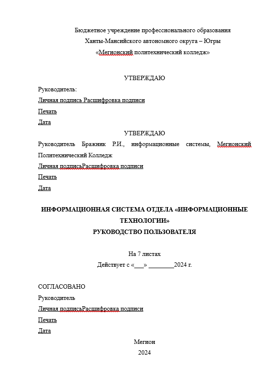
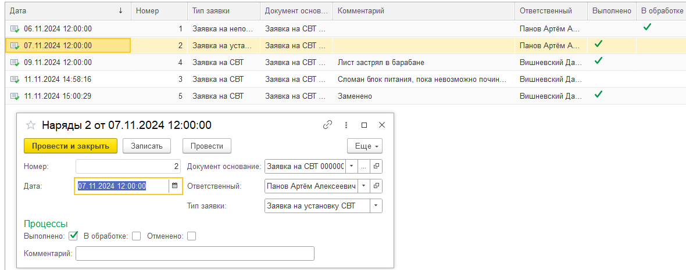
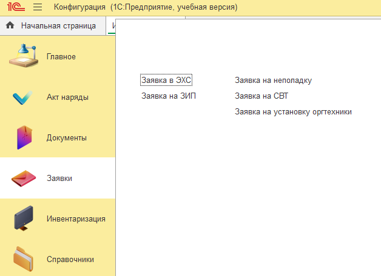

# Руководство пользователя
{width="8.259516622922135in"
height="11.687139107611548in"}

## 1\. Введение

Область применения.

Информационная система предназначена для автоматизации процессов
технического обслуживания вычислительной техники (ТО СВТ) в
организациях.

Краткое описание возможностей.

Система предоставляет возможности:

-   Планирования и учета ТО СВТ;

-   Управления заявками сотрудников;

-   Организации закупочной деятельности;

-   Инвентаризации и управления оргтехникой;

-   Утилизации и списания устаревшего оборудования.

Уровень подготовки пользователя.

Для работы с системой требуется базовое владение компьютером, навыки
работы с веб-интерфейсом и знание стандартных офисных приложений.

Перечень эксплуатационной документации.

Пользователь должен ознакомиться с:

-   Настоящим руководством пользователя;

-   Руководством по эксплуатации программного обеспечения,
    установленного на сервере.

## 2\. Назначение и условия применения

Виды деятельности.

Система предназначена для автоматизации следующих функций:

-   Регистрация и обработка заявок на ТО;

-   Ведение учёта оборудования и документов;

-   Контроль выполнения работ по ТО и ремонту;

-   Организация закупок и списания оборудования.

Условия применения.

Для работы системы необходимы:

-   Серверное оборудование с минимальными требованиями: процессор 4
    ядра, ОЗУ 8 ГБ, HDD 500 ГБ;

-   Операционная система: Windows Server или Linux;

-   Браузер (Google Chrome, Mozilla Firefox).

-   Требуется подключение к локальной сети организации или интернету.

## 3\. Подготовка к работе

Состав и содержание носителя данных.

Система поставляется с установочным пакетом и следующими файлами:

-   Инсталлятор 1С:Предприятие;

-   Информационная система;

Порядок загрузки программ и данных: загрузите базу данных для
клиентского приложения.

## 4\. Описание операций

Основные подсистемы.

1\. Авторизация:

Условия: Наличие учетной записи;

Действия: введите логин и пароль на экране входа, который изображен на
рисунке 1.

{width="6.302083333333333in"
height="3.3541666666666665in"}

Рисунок 1 -- Авторизация пользователя

2\. Система «Акт наряды»:

-   Создайте запись акта: введите данные о работе и результатах, которое
    изображено на рисунке 2;

-   Контроль и отчетность процесс работы.

{width="6.496527777777778in"
height="2.560416666666667in"}

Рисунок 2 -- Акт наряды

3\. Система «Документы»:

-   Проводите закупочную деятельность, утилизацию и списание оргтехники,
    которая изображена на рисунке 3.

{width="4.830080927384077in"
height="3.5708005249343833in"}

Рисунок 3 - Документы

4\. Система «Заявки»:

-   Подайте заявку, указав описание проблемы, изображенное на рисунке 4;

{width="5.673253499562555in"
height="4.119551618547682in"}

Рисунок 4 - Заявки

5\. Система «Инвентаризация»:

-   Добавляйте оборудование;

-   Проводите инвентаризацию, обновляя данные о состоянии оборудования,
    которое изображено на рисунке 5.

{width="3.3113363954505686in"
height="3.3047539370078742in"}

Рисунок 5 -- Инвентаризация

## 5\. Аварийные ситуации

1\. Отказ серверного оборудования

-   Перезагрузите сервер;

-   Проверьте соединение с сетью;

-   Обратитесь в службу поддержки.

2\. Ошибка в данных

-   Восстановите резервную копию базы данных;

-   Проверьте данные на наличие ошибок.

3\. Несанкционированный доступ

-   Заблокируйте учетную запись;

-   Проверьте логи действий пользователя.

## 6\. Рекомендации по освоению

Контрольный пример.

1\. Войдите в систему как Начальник ОИТ.

2\. Создайте тестовую заявку на ремонт.

3\. Назначьте ИТ-инженера.

4\. Проверьте статус выполнения заявки.

Рекомендации.

1\. Регулярно обновляйте данные инвентаризации.

2\. Настраивайте права доступа пользователей.

3\. Создавайте резервные копии данных.
